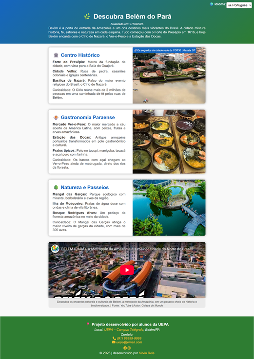
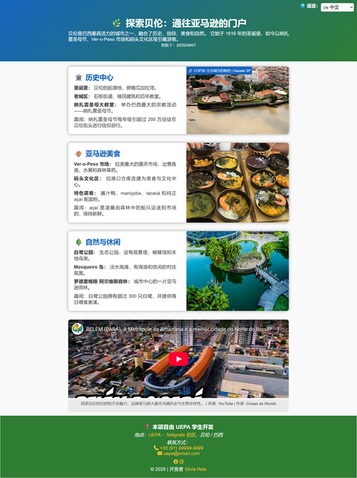

# 🌿 Descubra Belém - Site de Turismo

[](https://developer.mozilla.org/pt-BR/docs/Web/HTML)
[](https://developer.mozilla.org/pt-BR/docs/Web/CSS)
[](https://fontawesome.com/)  

**Projeto desenvolvido para treinamento em HTML e CSS**  
Curso: **Softex PE Programa Bolsa Futuro Digital** – Polo **UEPA**

---

## 🌎 Sobre o Projeto

Este é um **site de turismo** dedicado a **Belém do Pará**, destacando seus atrativos culturais, gastronômicos e naturais.  
O site foi desenvolvido para **praticar HTML e CSS**, com layout responsivo, cards de informações e integração de vídeo.

O site está disponível em **quatro idiomas**:

| Idioma | Link | Pré-visualização |
|--------|------|-----------------|
| 🇧🇷 Português | [index.html](https://github.com/Silviareis1/Silviareis1/blob/main/index.html) |  |
| 🇺🇸 English | [index-en.html](https://github.com/Silviareis1/Silviareis1/blob/main/index-en.html) |  |
| 🇪🇸 Español | [index-es.html](https://github.com/Silviareis1/Silviareis1/blob/main/index-es.html) |  |
| 🇨🇳 中文 | [index-zh.html](https://github.com/Silviareis1/Silviareis1/blob/main/index-zh.html) |  |

> Obs.: As imagens de pré-visualização devem ser capturas reais da página e hospedadas em um serviço de imagens como [ImgBB](https://imgbb.com/) ou GitHub.

---

## 🖥️ Tecnologias Utilizadas

- **HTML5** – Estrutura semântica  
- **CSS3** – Estilo e responsividade  
- **Font Awesome** – Ícones de contato e redes sociais  
- **Iframes** – Para vídeos do YouTube  

---

## 📁 Estrutura do Projeto

```
/projeto-turismo/
│
├─ index.html           # Versão em português
├─ index-en.html        # Versão em inglês
├─ index-es.html        # Versão em espanhol
├─ index-zh.html        # Versão em chinês
├─ css/
│  └─ estilos.css       # Estilo principal
├─ img/                 # Imagens do projeto e ícones
└─ README.md            # Este arquivo
```

---

## 🔧 Funcionalidades

- Seletor de idioma para alternar entre os quatro idiomas do site  
- Layout responsivo com **cards** para cada atrativo turístico  
- Vídeo incorporado do YouTube sobre Belém  
- Footer com informações de contato, redes sociais e créditos  

---

## 📌 Créditos

- Projeto desenvolvido por **alunos da UEPA**  
- Desenvolvido por: [Silvia Reis](https://github.com/Silviareis1/Silviareis1)  
- Curso: **Softex PE - Programa Bolsa Futuro Digital | Polo UEPA**  

---

## 🌐 Links

- Repositório GitHub: [Silviareis1](https://github.com/Silviareis1/Silviareis1)  
- GitHub Pages (pré-visualização online): [https://silviareis1.github.io/Silviareis1/](https://silviareis1.github.io/Silviareis1/)  

---

## 📜 Licença

Este projeto é **para fins educacionais**, sem fins comerciais.

